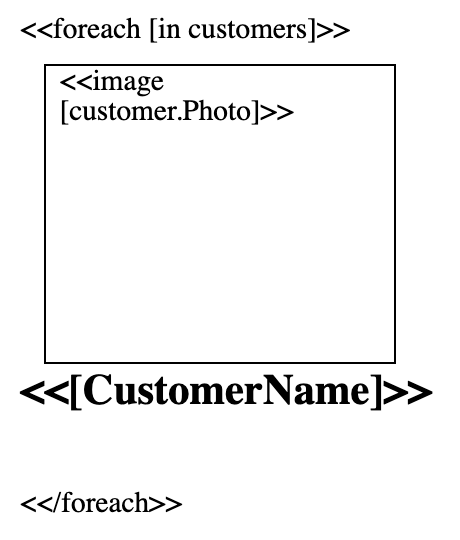

In this article, we will use GroupDocs.Assembly to generate a Common List report in HTML Document format.The code uses some of the objects defined in [The Business Layer](https://docs.groupdocs.com/assembly/net/the-business-layer/).This feature is supported by version 17.03 or greater.

## Common List in HTML Document

### Reporting Requirement

As a report developer, you are required to share the following key requirements:

*   A report must show multiple customers' picture and name.
*   A report must be generated in the HTML Document format.

### Adding Syntax to be evaluated by GroupDocs.Assembly Engine

### Download Common List Template

Please download the sample Common List document we created in this article:

*   [Common List.html](https://raw.githubusercontent.com/groupdocs-assembly/GroupDocs.Assembly-for-.NET/master/Examples/Data/Source/HTML%20Templates/Common%20List.html?raw=true)

### Generating The Report



