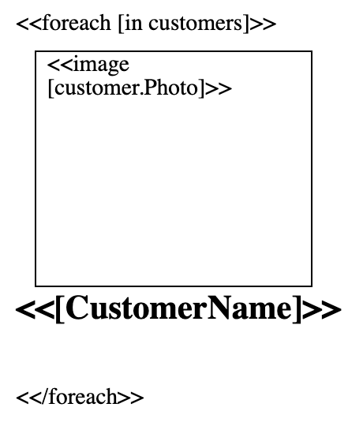

In this article, we will use GroupDocs.Assembly to generate a Common List Image report in Word Processing Document format based on the use case: [Working with a Business Case](https://docs.groupdocs.com/assembly/net/working-with-a-business-case/).The code uses some of the objects defined in [The Business Layer](https://docs.groupdocs.com/assembly/net/the-business-layer/).

## Common List in Microsoft Word Document

### Creating a Common List

Please follow below steps to create Common List Image document in MS Word 2013:

1.  Insert the desired shape to display image in it.
2.  Go to Insert Tab and select shape by clicking on Shape Icon.
3.  Save your Document.

### Reporting Requirement

As a report developer, you are required to represent the information of the customers with the following key requirements:

*   A report must show multiple customers' picture and name.
*   A report must be generated in the Word Processing Document.  
      
  

See how to use images in MS Word [here](https://www.youtube.com/watch?v=jIX01CSvo8Q&index=9&list=PL25CTxMCj5vOzsaE9Rwjwd4-OwvdaWmJ8).

### Adding Syntax to be evaluated by GroupDocs.Assembly Engine

For detailed technical information about syntax, expressions and report generation by the engine, please visit: [Working with GroupDocs.Assembly Engine](https://docs.groupdocs.com/assembly/net/working-with-groupdocs-assembly-engine/).

Download Common List Template

Please download the sample Common List document we created in this article:

*   [Common List.docx](https://github.com/groupdocsassembly/GroupDocs_Assembly_NET/blob/master/Examples/Data/Source/Word%20Templates/Common%20List.docx?raw=true)  
      

Use this template for DB, Dataset, JSON and XML examples also.

### Generating The Report

#### Custom Objects



#### Database Entities



#### Using DataSet



#### Using XML DataSource



#### Using JSON DataSource



## Common List in OpenOffice Document

### Creating the Template

OpenDocument Text (ODT) is a word processing document format which can be used as an alternative to Microsoft Word Document (DOC/DOCX) formats. Since ODT is not a Microsoft Proprietary format, there are multiple software (including Microsoft Office and Apache OpenOffice) available to create, open, edit and save this format. For more information on the available software to work with ODT, please visit [Wikipedia article](https://en.wikipedia.org/wiki/OpenDocument#Software).

In this topic, we'll not reinvent the wheel to recreate a template for generating an 'Common List' report in ODT format. Instead, we'll save the existing template to ODT format using Microsoft Office. In order to achieve this; assuming you are using Microsoft Office 2010, please follow below steps:

1.  Open existing template we created in [previous topic]()
2.  Click "File" and select "Save As".
3.  Select "OpenDocument Text" from "Save As Type" drop down.
4.  Click "Save".

### Download Template

*   [Common List\_OpenDocument.odt](https://github.com/groupdocsassembly/GroupDocs_Assembly_NET/blob/master/Examples/Data/Source/Word%20Templates/Common%20List_OpenDocument.odt?raw=true) (use same template for database, dataset, JSON and XML examples)

### Generating the Report

#### Custom Objects



#### Database Entities



#### Using DataSet



#### Using XML DataSource



#### Using JSON DataSource



### ODT Template and Report in Apache OpenOffice

In order to check compatibility of ODT between Microsoft Office 2010 and Apache OpenOffice 4.1.2, we performed below tests:

*   We opened the ODT template created through Microsoft Office 2010 in Apache OpenOffice 4.1.2. The template opened successfully in Apache OpenOffice without any issues or formatting losses.
*   We opened the ODT report generated through GroupDocs.Assembly in Apache OpenOffice 4.1.2. The report opened successfully in Apache OpenOffice without any issues or formatting losses.
